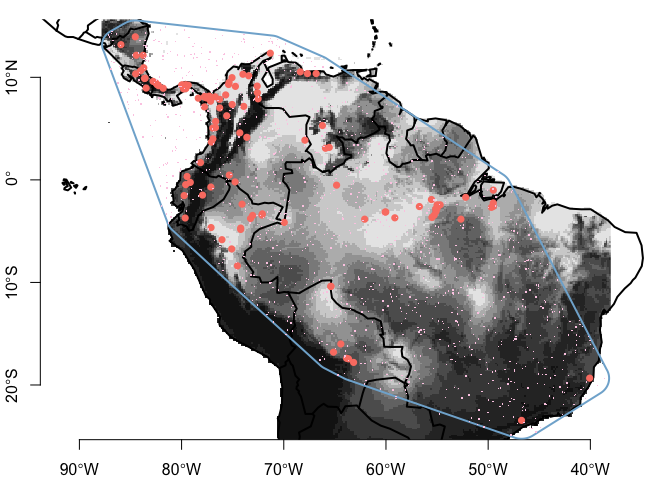
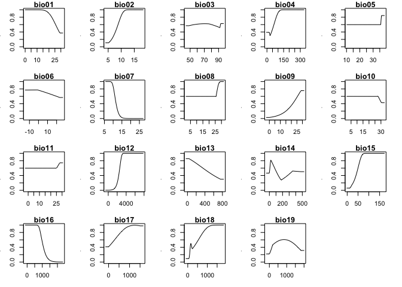
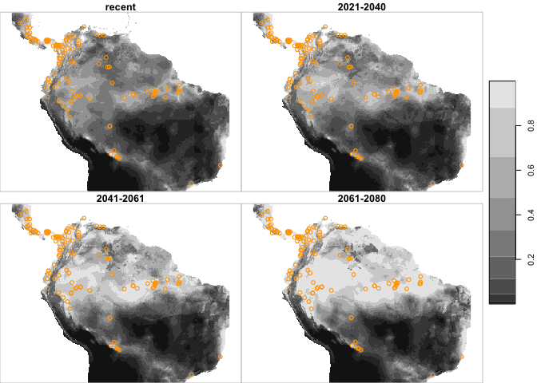

maxnet with stars
================

### Big idea

Here we show how we might model occurrence data and then predict using
[maxnet](https://CRAN.R-project.org/package=maxnet) in conjunction with
R packages [sf](https://CRAN.R-project.org/package=sf) and
[stars](https://CRAN.R-project.org/package=stars). We also use the
[geodata](https://CRAN.R-project.org/package=stars) for gathering
environmental covariate data.

``` r
suppressPackageStartupMessages({
  library(maxnet)
  library(dplyr)
  library(maxnet)
  library(sf)
  library(stars)
  library(geodata)
  library(dismo)
})
```

### Workflow

This example steps through the process of presence-only modeling using
the [maxnet package](https://CRAN.R-project.org/package=maxnet) It shows
how to…

-   obtain the Bradypus observation data from the venerable [dismo
    package](https://CRAN.R-project.org/package=dismo)

-   use the [geodata
    package](https://CRAN.R-project.org/package=geodata) to assemble
    predictor variable data,

-   collect background points within the region occupied by the presence
    points using [sf package](https://CRAN.R-project.org/package=sf)

-   model and predict using the [maxnet
    package](https://CRAN.R-project.org/package=maxnet)

### Obtain data

#### Occurrence point data

The presence points are stored within the [dismo
package](https://CRAN.R-project.org/package=dismo). Here’s how we read
them in to a data frame.

``` r
obs <- read.csv(system.file("ex/bradypus.csv", package = "dismo"))
head(obs)
```

    ##               species      lon      lat
    ## 1 Bradypus variegatus -65.4000 -10.3833
    ## 2 Bradypus variegatus -65.3833 -10.3833
    ## 3 Bradypus variegatus -65.1333 -16.8000
    ## 4 Bradypus variegatus -63.6667 -17.4500
    ## 5 Bradypus variegatus -63.8500 -17.4000
    ## 6 Bradypus variegatus -64.4167 -16.0000

Next we convert the data frame to a spatial ‘simple-features’ object.
It’s still a data frame, but the location information is consolidated
into a list column with of POINT class and we pick up spatial metadata.

``` r
obs <- sf::st_as_sf(obs, coords = c("lon", "lat"), crs = 4326)
obs
```

    ## Simple feature collection with 116 features and 1 field
    ## Geometry type: POINT
    ## Dimension:     XY
    ## Bounding box:  xmin: -85.9333 ymin: -23.45 xmax: -40.0667 ymax: 13.95
    ## Geodetic CRS:  WGS 84
    ## First 10 features:
    ##                species                  geometry
    ## 1  Bradypus variegatus    POINT (-65.4 -10.3833)
    ## 2  Bradypus variegatus POINT (-65.3833 -10.3833)
    ## 3  Bradypus variegatus    POINT (-65.1333 -16.8)
    ## 4  Bradypus variegatus   POINT (-63.6667 -17.45)
    ## 5  Bradypus variegatus      POINT (-63.85 -17.4)
    ## 6  Bradypus variegatus      POINT (-64.4167 -16)
    ## 7  Bradypus variegatus    POINT (-63.1667 -17.8)
    ## 8  Bradypus variegatus     POINT (-56.7333 -2.6)
    ## 9  Bradypus variegatus     POINT (-59.1333 -3.7)
    ## 10 Bradypus variegatus  POINT (-60.0833 -3.1333)

#### Environmental Covariates

Next we use the [geodata
package](https://CRAN.R-project.org/package=geodata) to gather CMIP
environmental data for recent times (1970-2000) as well as for 3 future
periods 2021-2040, 2041-2060 and 2061-2080).

``` r
path <- tempdir()
recent <- geodata::worldclim_global(var="bio", res=10, path = path) |>
  stars::st_as_stars() |>
  split()
names(recent) <- sprintf("bio%0.2i", seq_len(length(names(recent))))
```

Next we’ll get the modeled data (for the same variables) for the
2021-2040 and 2041-2060 future periods.

``` r
future_2021 <- geodata::cmip6_world(model = "CNRM-CM6-1", 
                              ssp = "585", 
                              res = 10, 
                              time = "2021-2040",
                              var = "bioc",
                              path = path) |>
  stars::st_as_stars(ignore_file = TRUE) |>
  split()

future_2041 <- geodata::cmip6_world(model = "CNRM-CM6-1", 
                              ssp = "585", 
                              res = 10, 
                              time = "2041-2060",
                              var = "bioc",
                              path = path) |>
  stars::st_as_stars(ignore_file = TRUE) |>
  split()

future_2061 <- geodata::cmip6_world(model = "CNRM-CM6-1", 
                              ssp = "585", 
                              res = 10, 
                              time = "2061-2080",
                              var = "bioc",
                              path = path) |>
  stars::st_as_stars(ignore_file = TRUE) |>
  split()
```

### Extract recent climate covariates for observations

Next we extract recent covariates for the observations. These are
briefly described [here](https://www.worldclim.org/data/bioclim.html).

``` r
env_obs <- stars::st_extract(recent, sf::st_coordinates(obs)) |>
  dplyr::as_tibble()
env_obs
```

    ## # A tibble: 116 × 19
    ##    bio01 bio02 bio03 bio04 bio05 bio06 bio07 bio08 bio09 bio10 bio11 bio12 bio13
    ##    <dbl> <dbl> <dbl> <dbl> <dbl> <dbl> <dbl> <dbl> <dbl> <dbl> <dbl> <dbl> <dbl>
    ##  1  26.7 10.9   74.9  63.6  33.7  19.2 14.5   26.8  26.0  27.5  25.9  1747   283
    ##  2  26.7 10.9   74.9  63.6  33.7  19.2 14.5   26.8  26.0  27.5  25.9  1747   283
    ##  3  25.5 11.0   64.8 191.   32.7  15.7 17.0   27.1  23.8  27.1  22.8  3613   567
    ##  4  24.3 10.6   63.1 230.   31.8  15.0 16.8   26.5  22.3  26.5  21.1  1637   274
    ##  5  24.3 10.8   64.2 224.   31.7  14.9 16.8   26.4  22.3  26.4  21.1  1758   290
    ##  6  25.6 10.4   64.0 179.   32.6  16.3 16.3   27.0  23.1  27.1  23.1  2631   408
    ##  7  24.1 10.0   61.5 232.   31.5  15.2 16.3   26.3  22.3  26.3  20.9  1257   196
    ##  8  27.3  8.18  76.6  68.7  33.2  22.6 10.7   26.6  28.1  28.3  26.6  2370   356
    ##  9  27.1  8.33  80.1  52.8  32.5  22.1 10.4   26.6  27.3  27.8  26.5  2279   306
    ## 10  26.9  7.89  81.7  50.3  32.1  22.5  9.65  26.4  27.1  27.6  26.4  2270   304
    ## # … with 106 more rows, and 6 more variables: bio14 <dbl>, bio15 <dbl>,
    ## #   bio16 <dbl>, bio17 <dbl>, bio18 <dbl>, bio19 <dbl>

### Points to characterize the recent background

We’ll create a polygon around the observations to limit the range of
random background point selection. Note that we buffer the polygon to
include neighboring areas. Also note that we temporarily transform to a
projection with rectilinear units to facilitate buffering.

``` r
poly <- obs |>                                # start with obs
  sf::st_combine() |>                         # combine into a single multipoint
  sf::st_convex_hull() |>                     # find convex hull
  sf::st_transform(crs = sf::st_crs(5880)) |> # make planar
  sf::st_buffer(dist = 200000) |>             # buffer by 200000m
  sf::st_transform(crs = sf::st_crs(4326))    # make spherical
```

Now we create a set of sample locations within the enclosing polygon,
`poly`. Immediately we’ll extract the recent climatic variables for
these background points.

``` r
N <- 1200
back <- sf::st_sample(poly, N)

env_back <- stars::st_extract(recent, sf::st_coordinates(back)) |>
  dplyr::as_tibble() |>
  na.omit()
env_back
```

    ## # A tibble: 1,041 × 19
    ##    bio01 bio02 bio03 bio04 bio05 bio06 bio07 bio08 bio09 bio10 bio11 bio12 bio13
    ##    <dbl> <dbl> <dbl> <dbl> <dbl> <dbl> <dbl> <dbl> <dbl> <dbl> <dbl> <dbl> <dbl>
    ##  1  20.7 11.0   67.8 141.   29.0  12.7  16.2  21.3  19.7  22.2  18.8  1185   229
    ##  2  25.2 12.1   70.5  78.5  33.9  16.8  17.2  24.6  25.0  26.4  24.6  1205   197
    ##  3  21.8 12.3   69.3 175.   28.9  11.1  17.7  22.9  19.3  23.0  19.2  1458   298
    ##  4  26.6 10.2   90.4  36.4  32.4  21.2  11.3  26.4  26.8  27.0  26.1  3063   372
    ##  5  18.6  9.02  88.3  25.9  23.7  13.5  10.2  18.3  18.6  18.9  18.3  1791   237
    ##  6  24.5 10.1   65.6 174.   31.5  16.1  15.4  25.8  22.0  26.3  22.0   818   131
    ##  7  25.1 10.1   79.3  43.9  31.6  18.9  12.7  24.7  25.3  25.7  24.7  1692   285
    ##  8  26.1 10.0   69.7  36.4  33.4  19.0  14.4  25.7  26.1  26.6  25.7  2254   337
    ##  9  26.2  9.95  79.5  33.8  32.4  19.9  12.5  26.1  25.8  26.6  25.7  2891   375
    ## 10  25.8  8.83  82.6  55.2  31.6  20.9  10.7  25.5  26.6  26.6  25.3  1778   297
    ## # … with 1,031 more rows, and 6 more variables: bio14 <dbl>, bio15 <dbl>,
    ## #   bio16 <dbl>, bio17 <dbl>, bio18 <dbl>, bio19 <dbl>

Let’s see what it looks like; we use the first recent covariate (Mean
Annual Temp) as the basemap. Note that some points are clearly not over
land so they won’t have values when we extract. That’s one reason we
selected a high number of points to characterize the environmental
setting - we know we’ll have to toss some.

``` r
col <- sf.colors(categorical = TRUE)
bb <- sf::st_bbox(poly)
plot(recent[1] |> sf::st_crop(bb), 
     main = "", axes = TRUE, key.pos = NULL, reset = FALSE)
maps::map('world', add = TRUE, lwd = 2)
plot(sf::st_geometry(obs), col = col[4], pch = 16, add = TRUE)
plot(sf::st_geometry(poly), add = TRUE, border = col[5], lwd = 2)
plot(back, add = TRUE, col = col[8], pch = ".")
```

<!-- -->

### Model

Now we have enough to build the model. First we create a flag vector
that distinguishes between observations (1) and background (0).

``` r
pres <- c(rep(1, nrow(env_obs)), rep(0, nrow(env_back)))
model <- maxnet::maxnet(pres,
                    dplyr::bind_rows(env_obs, env_back))
```

### Model Metrics

So what can we know about the model? We can retrieve a list of data
frames, each with a table of responses over the range of variable
values. We select the `cloglog` type which nicewly scales responses into
the familiar unity range.

``` r
resp <- plot(model, type = "cloglog", plot = FALSE)
names(resp)
```

    ##  [1] "bio01" "bio02" "bio03" "bio04" "bio05" "bio06" "bio07" "bio08" "bio09"
    ## [10] "bio10" "bio11" "bio12" "bio13" "bio14" "bio15" "bio16" "bio17" "bio18"
    ## [19] "bio19"

``` r
str(resp[['bio02']])
```

    ## 'data.frame':    100 obs. of  2 variables:
    ##  $ bio02: num  3.94 4.09 4.23 4.38 4.53 ...
    ##  $ pred : num  0.107 0.107 0.107 0.107 0.107 ...

We can plot the variable responses.

``` r
plot(model, mar = c(3,3,1,2), type = 'cloglog')
```

<!-- -->

### Predicting with rasters ([stars](https://r-spatial.github.io/stars/) class)

Here we predict using rasterized inputs cropped to the region of
interest.

``` r
clamp <- TRUE       # see ?predict.maxnet for details
type <- "cloglog"
preds <- c(predict(model, recent |> sf::st_crop(bb), 
                   clamp = clamp, type = type),
           predict(model, future_2021 |> sf::st_crop(bb) , 
                   clamp = clamp, type = type),
           predict(model, future_2041 |> sf::st_crop(bb), 
                   clamp = clamp, type = type),
           predict(model, future_2061 |> sf::st_crop(bb), 
                   clamp = clamp, type = type),
           along = list(time=as.Date(c("2001-01-01", 
                                       "2021-01-01", 
                                       "2041-01-01", 
                                       "2061-01-01"))))
preds
```

    ## stars object with 3 dimensions and 1 attribute
    ## attribute(s):
    ##               Min.    1st Qu.    Median      Mean   3rd Qu. Max.   NA's
    ## pred  3.669289e-06 0.02533652 0.2128956 0.3232429 0.5574923    1 125938
    ## dimension(s):
    ##      from  to     offset     delta refsys point values x/y
    ## x     554 852       -180  0.166667 WGS 84 FALSE   NULL [x]
    ## y     447 692         90 -0.166667 WGS 84 FALSE   NULL [y]
    ## time    1   4 2001-01-01 7305 days   Date    NA   NULL

And we can show the series with the original observations superimposed.

``` r
plot(preds,
     main = c("recent", "2021-2040", "2041-2061", "2061-2080"),
     hook = function(){plot(obs, col = "orange", add = TRUE)})
```

<!-- -->
